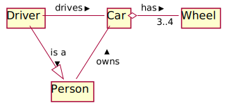
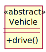
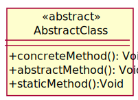

class: center, middle

# Class Modelling

UML Class diagrams

---

### Talking about programs

We often need to communicate information about the programs we’re working with

This is often easier using diagrams (they're more compact):

* Diagrams for the structure of the system

* Diagrams for interactions between parts of the system

* Diagrams about how the system moves from one state to another

---

### Class modelling

We're going to use the UML Class Diagram Syntax

* *Unified Modelling Language* - standardised notation developed in the late 1990s, based on earlier notations by famous engineers. ISO Standard since 2005

* Detailed enough that it *could* be used for code generation. 

* But typically, we're going to use it for *explaining* code. 

---

## How we use diagrams

When we're *talking* to another developer, we just hand-draw them.



--

If we're putting them in documentation, it's easier to *write the diagram in code*

```plantuml
class Car

Driver - Car : drives >
Car o- "3..4" Wheel : has >
Car -- Person : < owns
Driver -|> Person: is a >
```

The diagrams in this deck were drawn using [PlantUML](http://plantuml.com/).
They provide an [online server](http://www.plantuml.com/plantuml/uml/SyfFKj2rKt3CoKnELR1Io4ZDoSa70000), or there are [alternatives](https://plantuml-editor.kkeisuke.com/)

---

### A class

At its simplest, a class is just a box with it's name in it:


--

If we want to describe the fields and methods, we have a three-celled box:


* Name at the top
* Fields in the middle
* Methods at the bottom

**Note**: There's no "two-cell" variety. Even if you just want to show the methods but not the fields, use three cells.

---

### PlantUML decorations

So far, the diagrams I've shown have been as you'd hand-draw them.

By default, PlantUML generates diagrams with slightly prettier annotations


In these slides, I'll try to show both.

**Note:** You will generally find yourself hand-drawing diagrams (e.g. on whiteboards or the exam) more often than writing them in code.


---

### Types and visibility


Types come *after* the fields and methods, e.g.: `age: Int`

Fields and methods can be annotated with their visibility:

* `+` public
* `#` protected
* `~` *package* (the default in Java if you don't say anything else)
* `-` private

---

### Abstract classes and interfaces




*Stereotypes* can be written above the class name in &laquo;guillemets&raquo;

e.g., abstract, interface

--

By convention, we could also show these in italics, but then it's hard to tell an abstract class from an interface:


**Note:** Don't try to use italics when hand-drawing diagrams! 

---

### Abstract classes and interfaces in PlantUML

PlantUML's decorations make up for the issue of italics being hard to distinguish.


(But again, not if you're hand-drawing them)

---

### Abstract methods

Methods can also have stereotypes by writing them before the method name:


--

We can also show abstract methods *in italics*, and static methods <span style="text-decoration:underline">underlined</span>.




(But again, don't use underline or italic when hand-drawing diagrams)

---

### Inheritance and subtyping

Normally, we want to show *relationships between classes*. Let's start with inheritance


* Arrow with a hollow head is for inheritance...

* Use a solid line for extending a class

* Use a dotted line for implementing an interface


---

### Associations

For ordinary references between classes, use a line.

*Multiplicities* show how many:

* number, e.g. *1*
* min..max, e.g. *3..4*


---

### Navigability

Unless it is very clear, you should label the line. For example, a person could be in a lecture because they are a student *or* because they are the lecturer.

Arrows on the line indicate that the reference is *only navigable in one direction*. 


--

or let's show that with *objects* rather than *classes*


Note that for an *object diagram*, we used two cells in the box.

---

### Aggregation (white diamond)

The wheels are part of the car. But they can be taken off - the wheels' lifecycle and the car's lifecycle aren't identical


--

### Composition (black diamond)

A protest only exists if there's one or more protesters. And if you're not at a protest, you're not a protester. (The lifecycles of the objects are coincident.)


---

### Packages

Packages are shown as folders containing their classes. The dotted line shows a dependency rather than a reference.


---

### Pacakges and interfaces

We can also borrow the interface notation from component diagrams if we want to say something particular about how they are connected.


---

### Diagram drawing advice

Diagrams are a communication tool. So:

* Show what you want to explain

* Don't show things you don't want to explain. (It makes it harder to see what you are trying to say)

* Remember that you can use more than one diagram to explain your point. 