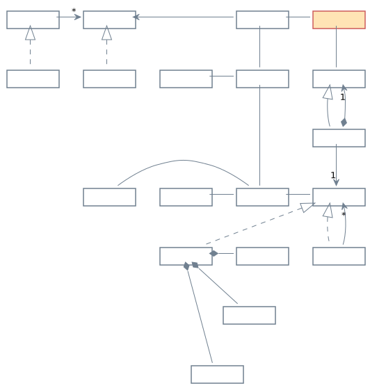
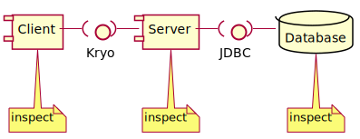
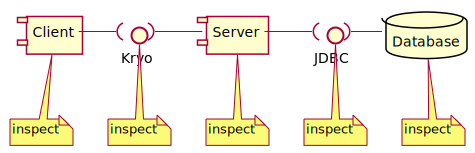

class: center, middle

# Debugging

---

### Debuggers and Debugging

Debuggers are:

* A tool that helps us see what's happening in a program

* **Not just for debugging**

<hr />

Debugging is:

* Searching for why a program is not doing what we hope.

* **Doesn't always use a debugger**

---

### Debuggers

Debuggers let us control the execution of the program at run-time.

It relies on functionality built into the JVM itself - the Java Debug Wire Protocol.

* The program is started with flags passed to the JVM. E.g.:

    ```sh
    -Xdebug -Xrunjdwp:transport=dt_socket,server=y,suspend=y,address=5005
    ```

  Note - you don't need to remember the flags. The IDE will do these for you.

* The IDE connects to the JVM over a port (in this case 5005). The JVM will then listen to commands from the IDE and let the IDE control the program's execution.

* This means the IDE can pause the program and show us what is happening.

---

### Breakpoints

Now that the IDE *can* pause the program, we need to decide *when* we want it to pause the program. This is a **breakpoint**

We can set breakpoints for:

* When the program reaches a certain line of code

* When it throws a particular exception

* When it loads a particular class (first use of that class)

* When it accesses or modifies a field, etc.

The easiest is to set a breakpoint on a line of code. Just double-click in the gutter next to that line in the IDE.

---

### Controlling program execution

When the code hits the breakpoint, the JVM will pause *that thread*. The other threads will still be executing.

Things we might want to do:

* Look at the values of local variables (or modify them)

* Explore up and down the call-stack (look at variables in the function that called this function)

* Step the program forward one step at a time, either *stepping into* or *stepping over* any method calls it might make

* Click "continue" to resume execution (until it hits the next breakpoint)

---

### Debuggers as an exploration tool

None of the actions of a debugger remove any bugs! (It isn't editing your code.)

Instead, it is an exploration tool that developers use to inspect what is happening in a program - usually when they are looking for a bug.

But it is also useful if you want to explore how some code you don't know works in action.

---

### Debugging as search

If there is a bug in your program, then some part of your code is not behaving as you'd hope.

But which piece of code?

Debugging is detective work - searching for evidence that might help you track down where the problem is.

The first place to start is *checking whether any tests fail*.

---

### Why we need many tests


Suppose this is our program

--

Suppose we have only 1 unit test

--

Suppose it failed

--

Which class caused the error?

---

### Unit test


Unit tests are automated tests that test  
class ... 


---

### Unit test



Unit tests are automated tests that test  
class ... by ... 


---

### Unit test


Unit tests are automated tests that test  
class ... by ... class

---

### Integration test


Integration tests are automated tests that test
group...

---

### Integration test


Integration tests are automated tests that test
group... by...


---

### Integration test


Integration tests are automated tests that test
group... by... group... 

---

### Integration test


Integration tests are automated tests that test
group... by... group... by group

--

We generally want **more unit tests** than **integration tests**.

---

### Evidence from tests

If we have many tests, we're more likely to be able to track down where the bug is from which test it caused to fail.

But you will encounter bugs where 

* The tests are failing, but you can't work out why, or

* The tests aren't failing because they didn't test that particular condition

--

We're going to need more evidence. But the next stop probably isn't the debugger.

Try looking in the *logs*.

---

### Evidence from printing things out

At some point in development, you have probably inserted something like this into your code to see what's going on:

```java
System.out.println("Got here with value " + this.myValue);
```

It is very helpful, but:

--

* The messages get cluttered if you have too many (because they are always printed out)

* They are often haphazard and difficult to search

* Turning them on and off requires editing the code

---

### Logging

Logging frameworks let us write messages into the code that:

* are better organised (formatted)

* can be turned on and off by editing a config file rather than recompiling.

* can even send the log messages over the network, so you can collect logs remotely

The logging framework we're using is **Log4J 2**

---

### Getting a logger

Loggers have a name. Typically, we ask the LogManager to give us a logger and name it after the class it will record logs for

```java
public class App {

  private static final Logger logger = LogManager.getLogger(App.class);

  // etc
```

Note: this means subclasses have a different logger than their parent class.

---

### Logging a message

A logger can then record messages for us at various *severity levels*: trace, debug, info, warn, error.

This is so we can switch on or off messages at the different severity levels.

```java
logger.info("Ping received from {}", conn.getID());
```

```java
logger.warn("Port argument could not be parsed {}", args[0], x);
```

```java
logger.error("Start up failed", ex);
```

--

<hr/>

Log messages are often printed to the console. E.g.:

```log
17:02:44.143 [workerManager-akka.actor.default-dispatcher-3] INFO  hsqldb.db.HSQLDB6C89C9429B.ENGINE - Checkpoint start
```

Note that it records the time, logger name, and severity level (not just the text)

---

### Configuring loggers

How the loggers behave is configured in a config file. For example, whether we want log messages recorded to a file or printed on the console.

`src/main/resources/log4j2.xml`

```xml
<?xml version="1.0" encoding="UTF-8"?>
<Configuration status="WARN">
  <Appenders>
    <Console name="Console" target="SYSTEM_OUT">
      <PatternLayout pattern="%d{HH:mm:ss.SSS} [%t] %-5level %logger{36} - %msg%n"/>
    </Console>
  </Appenders>
  <Loggers>
    <Root level="debug">
      <AppenderRef ref="Console"/>
    </Root>
  </Loggers>
</Configuration>
```

---

### Where to look 

Usually, it's a case of "divide and conquer", trying to see what is happening to the data at points where it is easy to find out.

Suppose our program looks like this:


---

### Where to look 

We might use SQL to look at the data in the database, and logging or the debugger to look at what the value is in the client and the server.



---

### Where to look 

If we need to narrow it further, we might log the messages that are being sent from the client to the server (and what they are being received as). Or we might log the queries and updates the database is making.



--

Each time, we are trying to discover "where is it ok" and "where did it go wrong" to give us a smaller space to look.

---

### Other sources of evidence

There are some other sources of evidence that our buildchain is giving us:

* Jenkins tells us which past builds succeeded and failed. So if our build is failing, is it succeeding on Jenkins? Did it suddently start failing, in which case in which commit?

* GitLab tells us what has changed (including what code). If it was working recently, perhaps look and see what code has changed to cause it to break?

---

### Eventually

As you debug, you are building up a mental model of

* how the program should work, and 

* how the program is (or isn't) working

This is very similar to exploring a new codebase.

Which is why when starting on a project, and trying to find out how someone else's code works, I sometimes advise:

> Change something, and see what breaks

(but don't check the broken code in!)