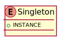
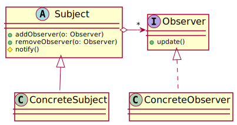
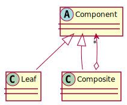

class: center, middle

# Design Patterns

---

### Hillside Terrace in Peru


*image: Alexson Scheppa Peisino, public domain*

---

### Lynchets in England


*image: Mike Barratt, public domain*

---

### Hillside terraces in the Philippines


*image: Agricmarketing, public domain*

---

### Christopher Alexander


*The Timeless Way of Building* (1979)

* What does it mean for a building or a town to be *alive*? The "quality without a name"

* *"Each building gets its character from just the patterns 
which keep on repeating there."* 

* What is needed to be able to "Sit on the porch, watching the world go by"?

<div style="clear: both;"></div>

---

### Christopher Alexander


Example: *South-Facing Outdoors*

* "People use open space if it is sunny, and do
not use it if it isn’t, in all but desert climates"

* "Always place buildings to the north* of the
outdoor spaces that go with them, and keep
the outdoor spaces to the south*. Never leave
a deep band of shade between the building
and the sunny part of the outdoors"

* Related patterns: Half-Hidden Garden,
Positive Outdoor Space, Wings of Light,
Indoor Sunlight, North* Face, Sunny Place

<div style="clear: both;"></div>

---

### "Gang of Four"


Takes the same concept of Design Patterns and applies it to Object-Oriented Software.

> “One thing expert designers know not to do is solve every
problem from first principles. Rather, they reuse solutions
that have worked for them in the past. When they find a
good solution, the use it again and again. Such
experience is part of what makes them experts.
Consequently, you’ll find recurring patterns of classes and
communicating objects in many object-oriented systems.
These patterns solve specific design problems and make
object-oriented designs more flexible, elegant and
ultimately reusable. They help designers reuse successful
designs by basing new designs on prior experience. A
designer who is familiar with such patterns can apply them
immediately to design problems without having to
rediscover them." 

<div style="clear: both;"></div>

---

### A note on patterns

As programming languages evolve, some patterns may become subsumed into the language. For example, consider a language before `while` loops:

```fortran
A: IF T > 10 GOTO B
   PRINT T++
   GOTO A
B: PRINT END
```

--

Whereas in a language with `while` it might become:

```java
while(t <= 10) {
  print(t++);
}
print(end);
```

--

As we're working in Java, we can consider the OO design patterns from the book

---

## Parts of a pattern

Design patterns typically have:

--

* A name

--

* An intent

--

* Applicability (when's it good?)

--

* Structure

--

* Consequences

--

* Examples

--

* Related patterns

---

### Singleton

**Intent:** Ensure a class only has one instance and provide a global point of access to it

**Participants:** Singleton

**Collaborators:** Clients access a singleton solely through the Singleton's `getInstance` operation

**Examples:** Servers, Communications sessions, Registries





```java
public enum MuckServer {

  INSTANCE;

  // Fields and methods

}
```

---

### Observer

**Intent:** Define a one-to-many dependency between objects so that when one object changes state, all its dependents are notified and update automatically

**Examples:** Storm warnings

**Participants:** Subject, Observer

**Collaborators:** addObserver(obs), notify(), update(subj)

**Consequences:** Loose coupling between Subject and Observer



---

### Observer


The observer pattern lets the subject keep a list of observers that need notifying whenever anything changes.

It is very similar to keeping a list of event listeners

As `Observer` is often a *single abstract method* interface, it can often be expressed as a lamda

```java
public interface Observer {
  void update();
}
```

```java
subject.addObserver((s) -> {
  // do something
})
```

<div style="clear: both;"></div>


---

### Observer in code

(Demo)

---

### Mediator

**Intent:** Mediator reduces chaotic dependencies between objects, when there are many participants. Rather than have each participant keep a reference to every other participator, instead they only keep a reference to a mediator.

**Examples:** Telephone exchange, air traffic control

**Participants:** Participant, Mediator


---

### Mediator in code

```java
public enum Mediator {
  INSTANCE;

  Map<String, Participant> participants = new HashMap<>();
}
```

```java
public interface Participant {
  // 
}
```

```java
public class CP extends Participant {

  public void foo() {
    Mediator.INSTANCE.get("Alice").performAction();
  }

}
```


---

### Composite

**Intent:** Compose objects into tree structures to represent part-whole
hierarchies. Composite lets clients treat individual objects and compositions
of objects uniformly.

**Participants:** Component, Leaf, Composite, Client

**Collaborations:** Clients interact with Components

**Examples:** Expression tree



---

### Leaf node example

Suppose we were creating an expression builder, that only worked on numbers

```java
public abstract class ExpessionNode {

}
```

A number might be a valid node:

```java
public class NumberNode extends ExpressionNode {
  double number;

  public NumberNode(double:Int) {
    this.number = n;
  }
}
```

---

### Composite node example

An *addition* node could also be a valid expression

```java
public class AddNode extends ExpressionNode {
  ExpressionNode left;
  ExpressionNode right;

  public AddNode(ExpressionNode left, ExpressionNode right) {
    this.left = left;
    this.right = right;
  }
}
```

Although it has children, it itself is an ExpressionNode, so that you can say `((1 + 2) + 3)`

```java
ExpressionNode n = new AddNode(
  new AddNode(new NumberNode(1), new NumberNode(2)),
  new NumberNode(3)
);
```

---

### Composite examples

* Nested menus - a menu is a list of menu items, but it can be a menu item

* Graphics - shapes can be combined into a group, which in turn can be combined with other shapes or groups

---

### Visitor pattern

**Intent:** One or more operators need to navigate through a complex structure (e.g.: a tree) and perform an action on each node.

**Participants:** Element, Visitor

**Consequences:** The visitor and the structure are decoupled - the visitor does not need to understand the structure, only the elements.

**Examples:** Running operations across an expression tree


---

### Visitor pattern

Suppose we have a tree that has one parent node and two child nodes. 

The visitor doesn't have to know anything about how to navigate the structure it is calling. Instead, the structure will call `visit(el)` on the Visitor for each element.


---

### Combining patterns

*Composite* and *Visitor* combine well. The composite pattern represents a complex data structure. The visitor pattern makes it possible to run arbitrary functions across the elements in the structure.

```java
public interface ExpessionVisitor {
  void visit(ExpressionNode node);
}
```

```java
public abstract class ExpessionNode {
  public void accept(ExpressionVisitor v);
}
```

---

### Patterns and Languages

Visitor is often criticised as something that could be better implemented using functional programming. 

For example, most data structures now already implement `forEach`

```java
myTree.forEach((e) -> {
  // actions I want to perform on elements
}).
```

But functional languages tend to provide more advanced functions, such as `fold` or `map`

---

### Decorator pattern

**Intent:** The decorator pattern is a flexible alternative to subclassing, that can allow objects to be "decorated" with extra abilities at run-time.

**Example:** Special abilities in games, request handlers can be decorated with authentication filters 


```java
public class CountingMap<K,V> implements Map<K,V> {
  Map<K,V> m;
  int count = 0;

  public void CountingMap(Map<k,V> m) {
    this.m = m;
  }

  public void put(K key, V value) {
    this.count += 1;
    m.put(key, value);
  }
}
```

<div class="clear: both;"></div>