class: center, middle

# Requirements analysis

---

class: center, middle

.so[

.caption[
image: dilbert.com, linked not copied
]
]

.no[
http://assets.amuniversal.com/3c9aa7b06d5101301d7a001dd8b71c47
]

---

class: center, middle

## How can we know what the system should do?

---

### So far: User Stories

* Small enough to put on a post-it note

> As a [ROLE], I want [GOAL/DESIRE], so that [BENEFIT]

eg:

> As a customer, I want to withdraw money from the ATM, so that I have cash to spend in shops

* But that doesn't tell me **how**

---

### Some things I would like to know

* **Who** is this [ROLE] who has these needs, and how do we know they have them?

--

* **How** should this feature work?

--

* **How** does this feature relate to the system design?

---

### As a traveller I want to reach my destination quickly, so I can spend more time doing what I want

--

* Bicycle?
* Car?
* Train?
* Aeroplane?

--

Just as we need ways to sketch the class design, we need ways to sketch the interaction design

---

### Who is this [ROLE] anyway?

* **User Centred Design** is the practice of first investigating your users, and what their *real* needs are, before attempting to design a system for them.

* Often performed in "Sprint 0", or by a UX team

* Many techniques
  - Focus groups / facilitated meetings
  - Interviews
  - Observations
  - Surveys
  - Document analysis
  - Prototyping

---

## Contextual Design

--

* Contextual inquiry

--

* Interpretation session

--

* Work models and affinity diagramming

--

* Visioning

--

* Storyboards

--

* Interaction patterns & user environment design

--

* Paper prototype interviews

---

class: center, middle, bigquote

> "People know **everything** about what they do; they just can't tell you" &mdash; Karen Holzblatt

???

shoelace example

Marcus's doctor example.

Karen Holtzblatt's grocery picking example

---

## Contextual inquiry

- Go **out** into the field
- Talk with **the people that are our target**...
- ...about what they do **while they are doing it**.
- "low-level detail you need to understand lives"

???

"Not into a conference room"
"Don't ask their managers"

"Don't (just) observe, don't videotape"

---

## Contextual inquiry

* Master / apprentice
* Think-aloud
  - (except you will ask questions)
* Four principles:
    1. Context
    2. Partnership
    3. Interpretation
    4. Focus

???

An apprentice doesn't just watch their master at work. They ask questions. They try to learn enough to understand how to do this themselves.

You'll find out the user's perspective on the task and the problems they face. **Your** analysis will then help determine the causes.

"it's not in the index..."

"generally", "usually", present tense suggest abstractions. Want "we did"

you can't help designing in the moment. So do.

---

## What would you do if...

* ...the user says something technical you don't understand?
* ...the user does something "wrong"?
* ...you find yourself wanting to nod?

---

## Any > None

* Interviewing five users is better than one
* Interviewing one user is better than none
* Interviewing at their desk is better than at their meeting room
* Interviewing at their meeting room is better than at your meeting room

---

## Interpretation

* **Flow model**
    - what are the responsibilities of people in a workplace?
    - how do they coordinate and interact?
* **Sequence model**
    - What are the steps users go through to accomplish an activity?
    - (don't generalise)
* **Cultural model**
    - what are the influences and pressures in the work environment?
* **Artifact model**
    - what documents or things are created in / support the work?
* **Physical model**
    - "caricature of the workplace"

---

## Interpretation

* Team activity (your team)
* Consider all the field interviews
* Team adds insights and facts as notes

---

## Affinity diagramming

* Typically 8-10 user interviews
* 50 to 100 notes produced per user interpretation session
* So typically 500 to 1,000 notes!
* "Walk the wall"

---

## Stage 1 (White notes)

* Someone reads a note and sticks it on the wall. The first column.
* Everyone looks through their notes to see if they have something similar
* If they do, read it aloud and stick it under the note.
* If not, someone reads a new note to start a new column.
* Repeat until about 10 columns.

---

---

---

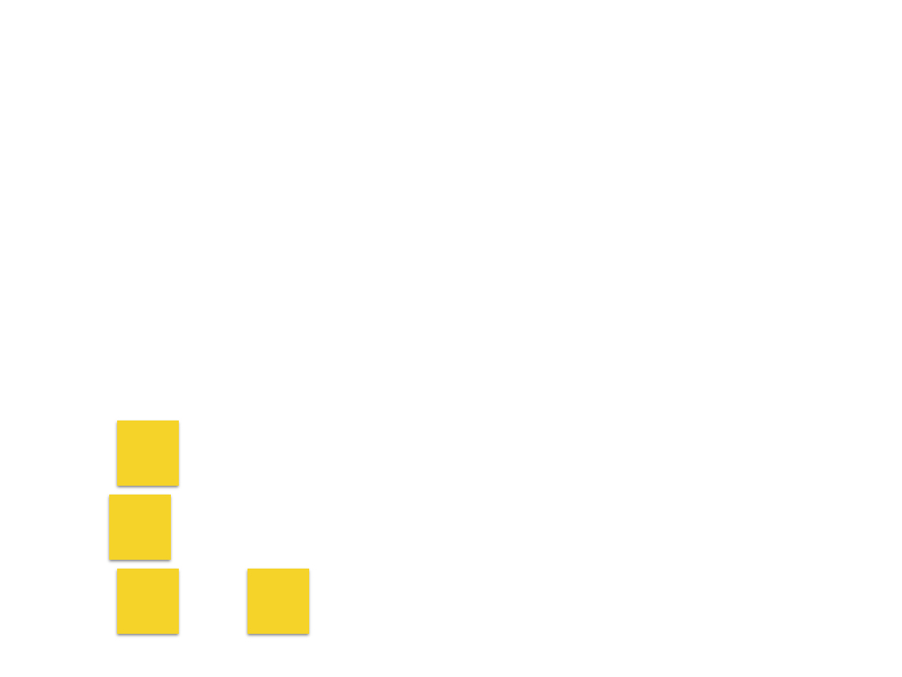

---

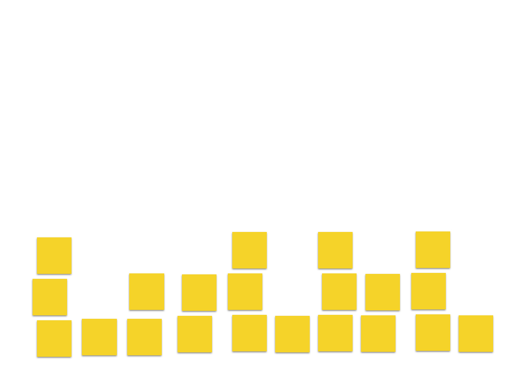

---

## Stage 2

* Keep adding new notes, but don't read them aloud unless they start a new column
* Anyone may move a note (no discussion)
* Aim to fill groups before starting new columns
* Don't go by keyword (eg, "email")
* Create new "distinctions" by moving notes
* Get the notes on the board before worrying about labelling them

---

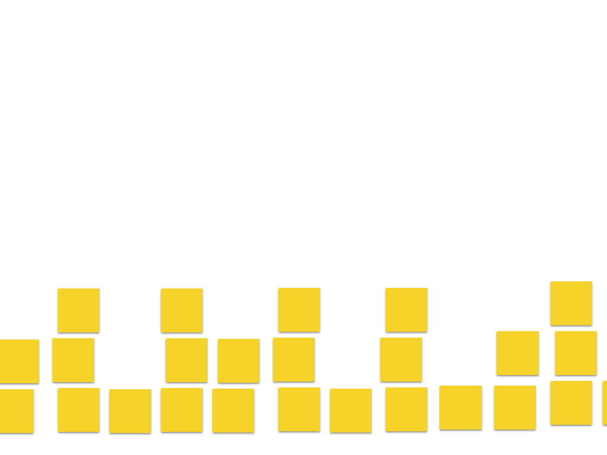

---

## Stage 3 (Blue notes)

* Eventually you'll find it hard to keep track of the groups. Add "blue notes" labelling them.
* Pairs of people put blue notes (someone to bounce ideas off)
* Start labelling with the longest columns
* Break long columns up (aim for <=6 notes per group). Look for other notes that could join.

---

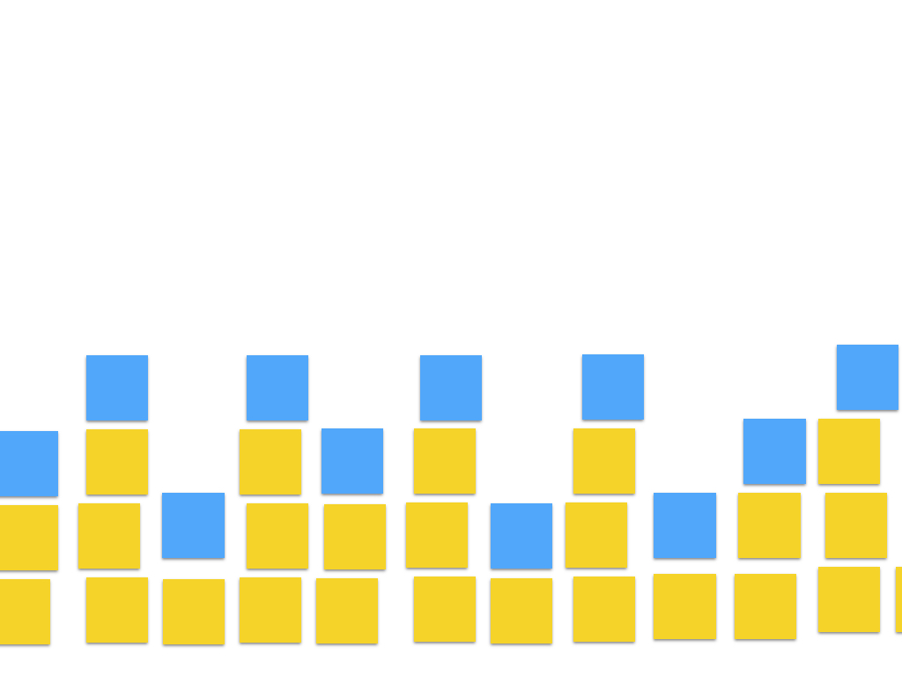

---

## Stage 4 (Pink and Green notes)

* Grouping the groups
* Temporary green labels:
    - Big steps, communication strategies, etc
* Within a green label:
    - restructure the blue labels to remove redundancy
    - create pink groups by grouping like blue labels
* Group the pink labels to create final green labels

---

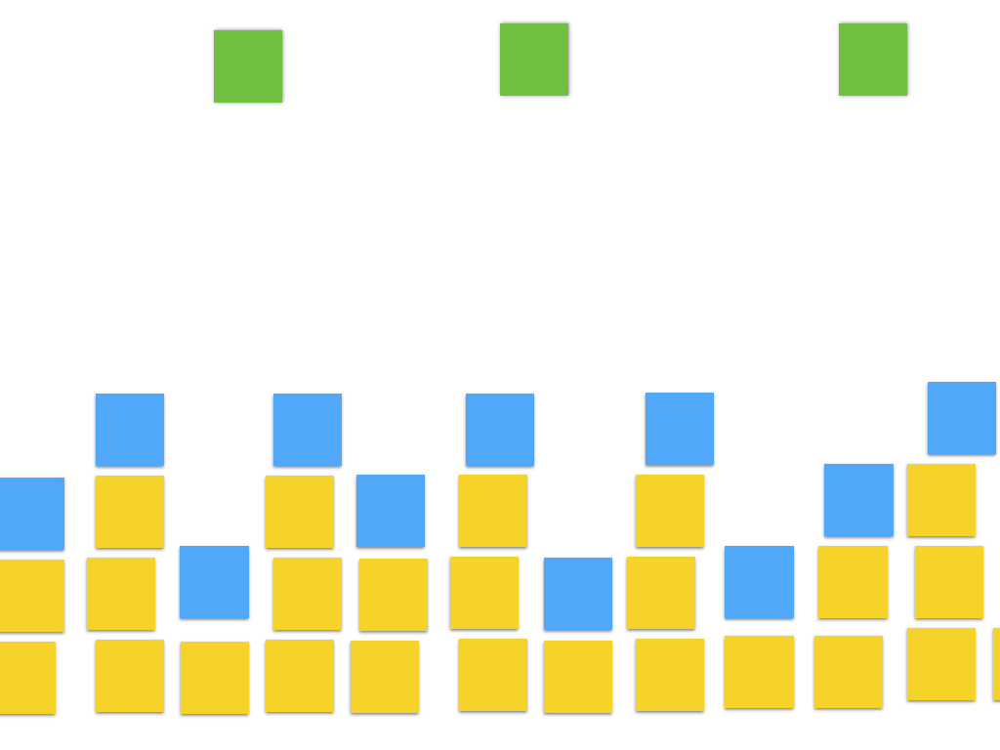

---

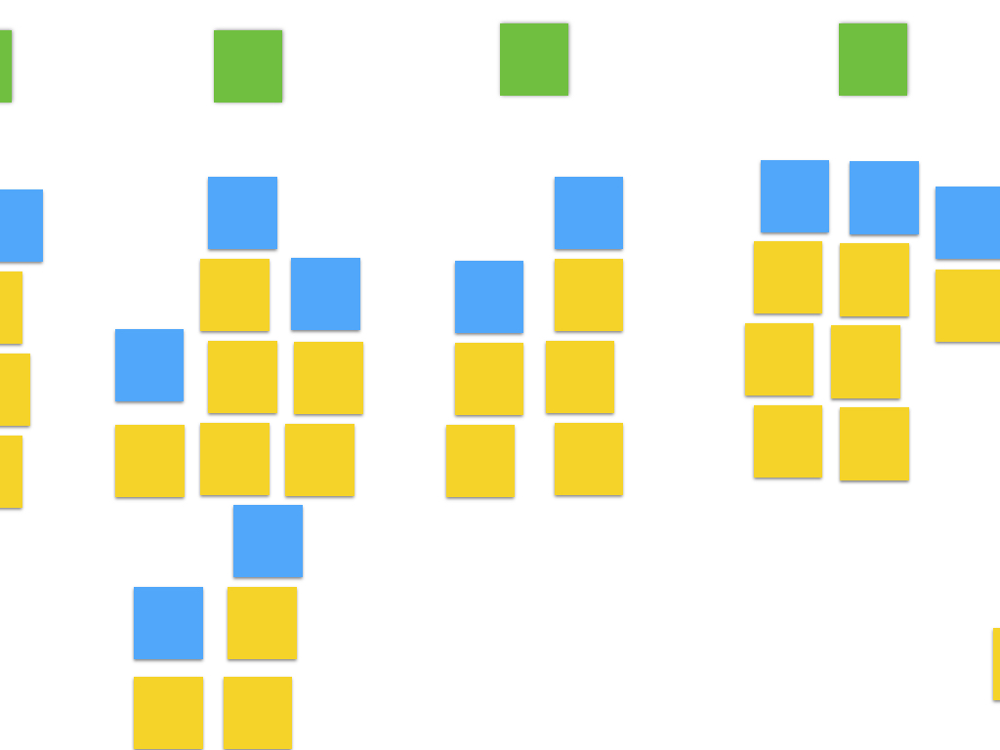

---

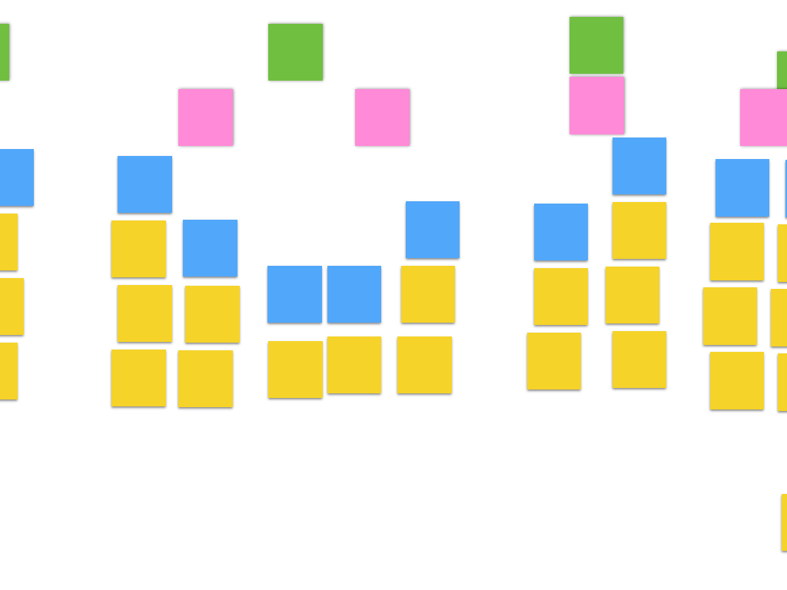

---

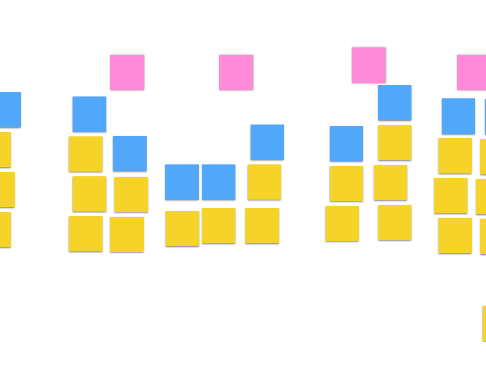

---

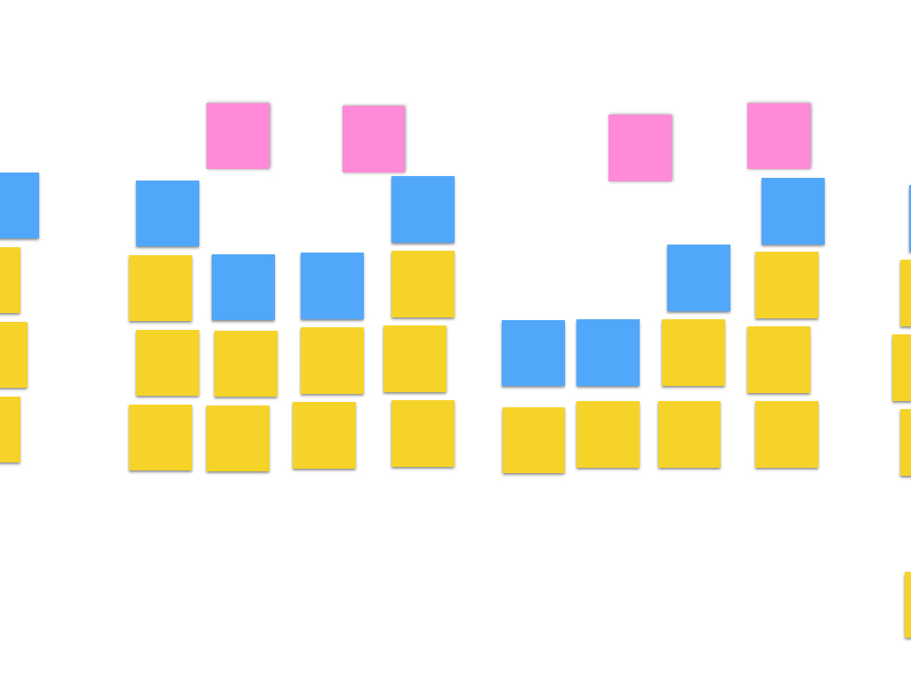

---

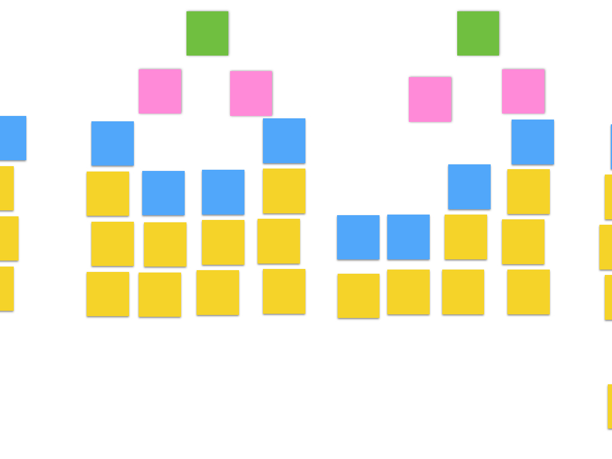

---

## Example

* We delegate our work (green)
    - Why we delegate (pink)
        - I don't want to deal with it (blue)
        - I have too much work (blue)
    - How I choose who to delegate to (pink)
        - Whoever is available does it (blue)
        - The person with the job does it (blue)
    - How I go about delegating (pink)
        - I give it away, but I'm still responsible (blue)
        - I give it away at a meeting (blue)
        - I pass it on informally (blue)

.caption[
Beyer, H. and Holtzblatt, K., 1998. "The Affinity diagram". In: Contextual Design p154-153, Morgan Kauffman Publishers
]

---

## Alternative

---

class: center, middle, bigquote

> Could we do this in a tool? When we have wall-sized displays!

---

## Personas

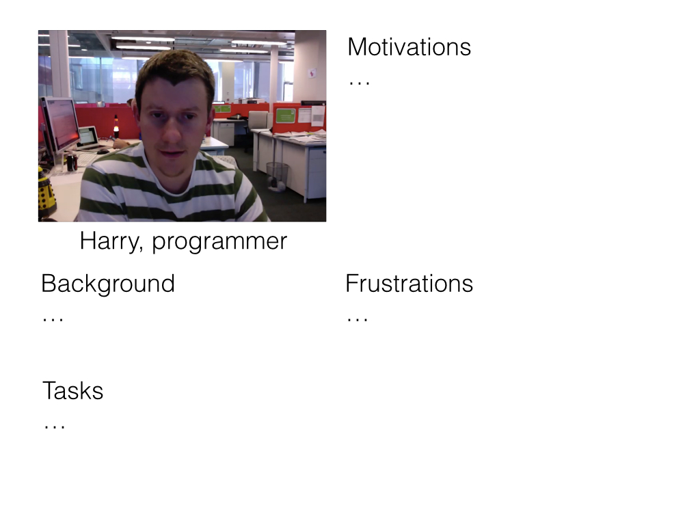

---

## Empathy map

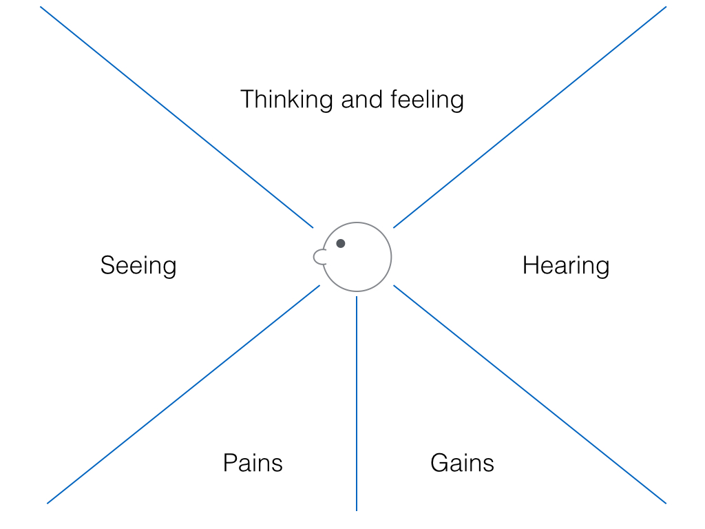

---

## Empathy map

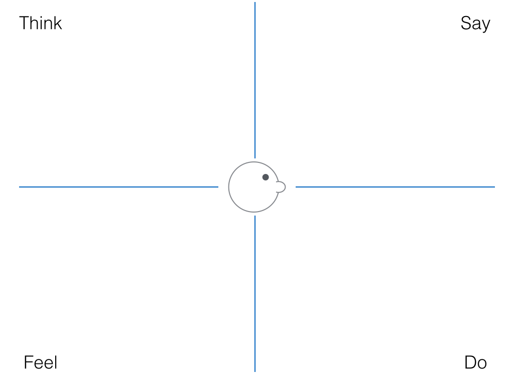

---

## Personas

http://wiki.fluidproject.org/display/fluid/Fluid+Personas

---

## Visioning

* All this has been part of "empathise" and "define" 
* Walk the wall to ideate
* Cross-functional team
    - (if you include users, "participatory design")
* "Facilitated group storytelling"

---

## Storyboarding

* Working out the details of the vision
* Let's do one...

---

## Storyboard for a Web Clicker

---

## User environment design

* What should the new "physical model" be like
* (again a caricature)

---

## Paper prototype interviews
