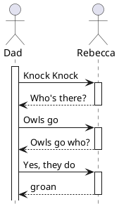

class: center, middle

# Sequence Diagrams

COSC220

---

### Sequence Diagrams

* *Class diagrams* showed the structure of our entities (static relationships)

* *Sequence diagrams* can show the dynamic interactions between them

* Each participant has a *lifeline*. Time runs down the page.

* The box shows when that participant is *active*

* Solid lines represent messages being sent. Dotted lines are responses being returned synchronously.

---

### Sequence Diagrams in PlantUML

---

### Creating and destroying

* Creating participants is shown by putting their box further down the lifeline.

* Destroying participants is shown with an X

---

### Loops and Alts

* *Alternatives* and *loops* are shown as fragments

* The condition is placed in [ square brackets ]

* *Optional* sections are also shown as a fragment, labelled "opt"

---

### Actors

* So far, I've been showing people using the `Actor` logo (stick figure)

* Anything outside the "system boundary" (the part you are designing) is usually shown as an actor.

  e.g., if you're designing the ATM, that doesn't mean you're designing the bank

---

class: bottom

Written by Will Billingsley while at NICTA, UQ, and UNE

<small>
 This work is licensed under a <a rel="license" href="http://creativecommons.org/licenses/by/4.0/">Creative Commons Attribution 4.0 International License</a>.</small>