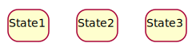
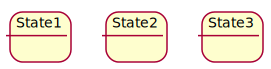
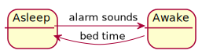
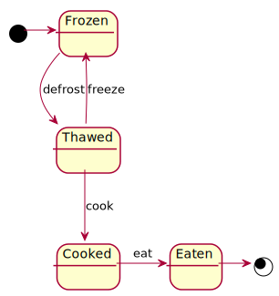
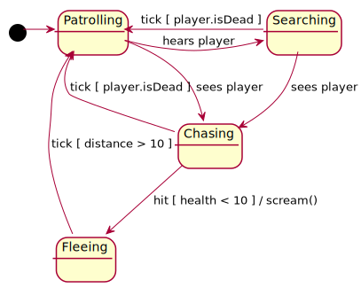
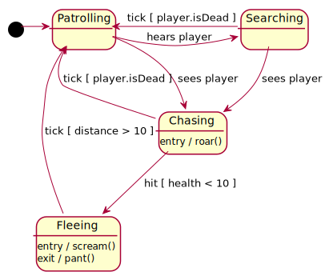
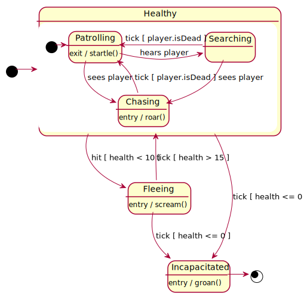
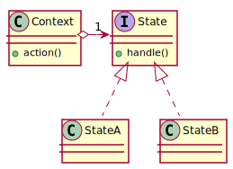
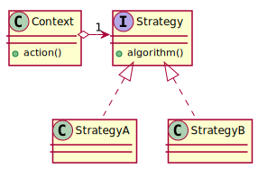

class: center, middle

# State Machines

---

### State Machines

Some objects should respond differently to a stimulus depending on what state they are in. For example:

* Pressing the "minutes" button on the alarm clock, depending on whether you're setting the time or the alarm.

* Turning the ignition on your car if the doors are still open

In this slide deck, we'll take a quick look at the UML State Diagram format...

...and then take a look at the *State* and *Strategy* patterns.

---

### States

States are named and shown as rounded rectangles



--

Optionally, they can also have a description box.



--

Transitions between states are shown with arrows. These need to be labelled with the events that cause the transitions



---

### Start and End states

A state machine needs to know where to start. This is marked with a black circle. There can only be *one* starting state.

It might also have one or more end states - marked with a ringed black circle.



---

### Transition guards

Transitions between states can be conditional - that is, they can have a *guard* in square brackets.


---

### Effects 

We can also show *effects* on transitions by putting them after a `/`. For example, this game character screams when it flees.



---

### Entry and Exit effects

Alternatively, we can place *entry* and *exit* effects within the states themselves.




---

### Compound states



It could be repetetive to show the same transitions from many states. For example, perhaps the game character should also flee if it is hit in the patrolling or searching states (not just the chasing state).

We can show this by grouping the sources of those transitions into a compound state. Transitions from a compound state act as if they were defined from each contained state.

<div style="clear: both;"></div>

---

### State and Strategy

The state and strategy patterns are unusual in that they have the same structure, but differ in intent.




---

### State pattern

**Intent:** We have an item whose behaviour should change depending on what state it is in.

**Example:** Monster in a game (whether it patrols, chases, or runs away). By delegating the action to the state object, changing the state changes the behaviour.


```java
class Monster {
  public void act() {
    currentState.act(this);
  }
}
```

---

### Strategy pattern

**Strategy intent:** We have some action that could be accomplished in a number of different ways

**Example:** Sorting - a Sorter could apply one of a number of different algorithms. This pattern lets the strategy be changed.


```java
public class Sorter {
  public void setAlgorithm(SortAlgorithm alg) {
    this.algorithm = alg;
  }

  public void sort(List<T> l) {
    this.algorithm.sort(l);
  }
}
```

